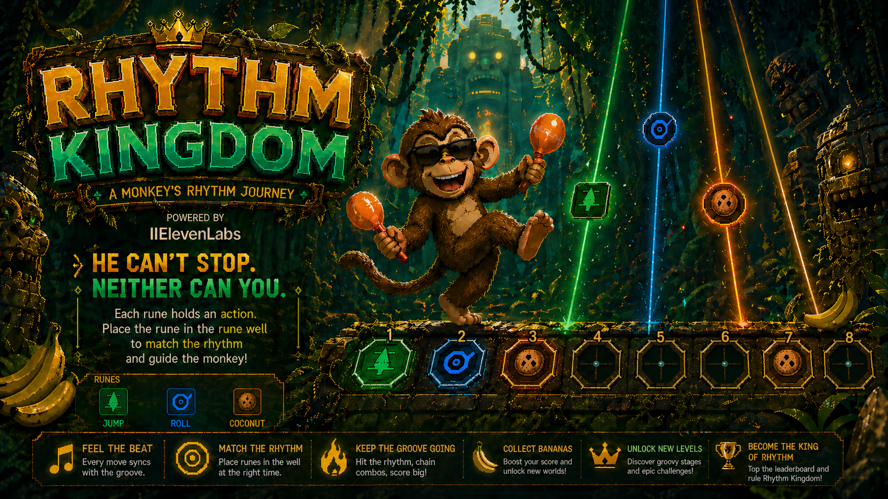
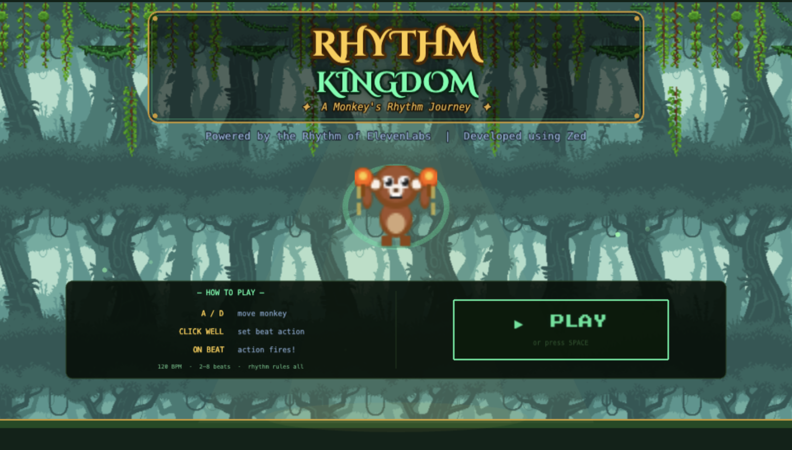
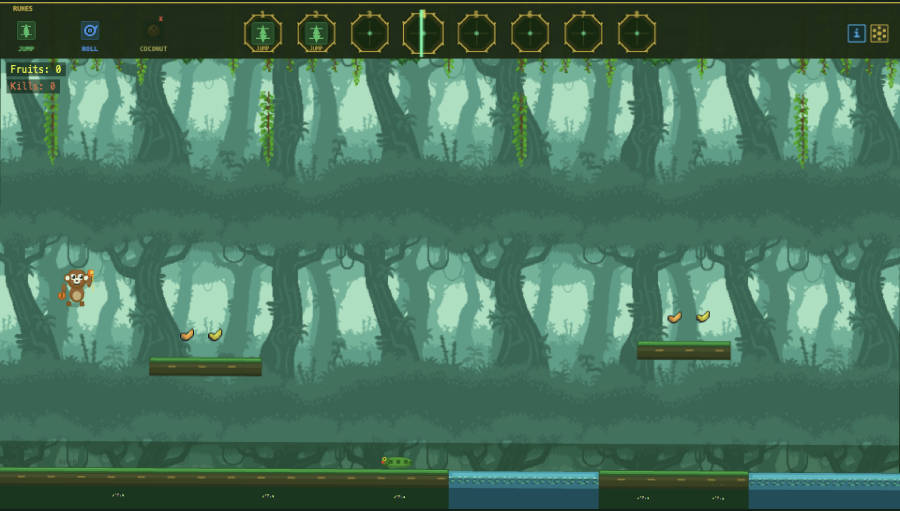
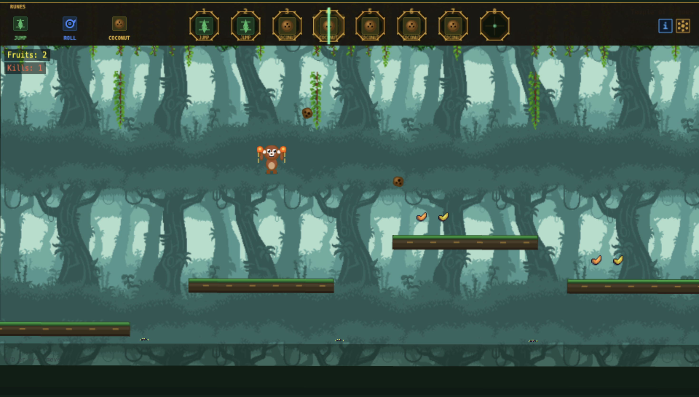

# Rhythm Kingdom

**Meet the monkey who can't stop dancing.**

> **ElevenHacks Hackathon** — A split control rhythm arcade game. You handle movement. The beat handles everything else.

[](https://rhythm-kingdom.pages.dev)
[](https://elevenlabs.io)
[](https://phaser.io)
[](https://developer.mozilla.org/en-US/docs/Web/API/Web_Audio_API)
[](https://developer.mozilla.org/en-US/docs/Web/JavaScript)
[](https://pages.cloudflare.com)
[](https://elevenlabs.io)

> He's been dancing since before you got here — maracas shaking, feet locked to the beat.
>
> You can move him. You can't control what he does next.
>
> Eight beats. Eight slots. Drop runes. On the beat, they fire — ready or not.
>
> Jump. Roll. Throw. Miss the timing and you die.

<p align="center">
  
</p>

---

## Table of Contents

- [What is Rhythm Kingdom?](#what-is-rhythm-kingdom)
- [How It Works](#how-it-works)
- [Key Features](#key-features)
- [Rune System](#rune-system)
- [Tech Stack](#tech-stack)
- [Screenshots](#screenshots)
- [Running Locally](#running-locally)
- [ElevenLabs Integration](#elevenlabs-integration)
- [License](#license)

---

## What is Rhythm Kingdom?

Split-control rhythm arcade game — entirely in the browser. No backend. No bundler. No build step.

You move the monkey with A/D or arrow keys. But jumps, rolls, and coconut throws only happen on the beat — placed as action runes in a sequencer panel at the top of the screen.

The screen shakes to the beat. Lights pulse. Every action triggers its own audio stem. All locked to tempo — everything perfectly synced, nothing out of time, in a single flow. When it all locks in, it's not just gameplay — it's a performance.

Stack two JUMP runes for a double jump. Chain ROLL into a gap. Time your coconut throw to hit a snake mid-patrol.

All audio — percussion, bass, jungle textures, animal sounds, voice-overs — generated using ElevenLabs Sound Effects, Music, and TTS APIs. Layered to build the atmosphere. Locked to tempo.

You lose the rhythm. You die. You try again.

**Place the rune. Hit the beat. Don't fall behind.**

---

## How It Works

**1. Place Runes** — Click the beat slots at the top of the screen to cycle through available runes (JUMP, ROLL, COCONUT). Each slot corresponds to a beat in the loop.

**2. The Beat Fires** — At 120 BPM, the sequencer advances through your slots. When it hits a filled slot, the action executes — no button press needed.

**3. Move Freely** — Use A/D or ← / → to move the monkey left and right at any time. Timing the movement with your rune placement is the core skill.

**4. Unlock Runes** — Collect rune shards hidden in the levels to unlock new abilities. Start with JUMP and ROLL. Unlock COCONUT throw in level 2.

**5. Survive** — Snakes mean instant death. Water pits require precise jumping. Wide gaps need double jumps. Roll under the standing pillar.

---

## Key Features

| Feature | Description |
|---------|-------------|
| **Rune Sequencer** | 2–8 configurable beat slots — place and cycle runes to schedule actions |
| **Double Jump** | Stack JUMP in two consecutive slots for a higher arc — max 2 in a row |
| **Party Lights** | Full-screen colour pulse on every beat — white, red, yellow, green cycling |
| **Fruit Collectibles** | Melons scattered on elevated platforms — collect for score |
| **Enemy System** | Snakes, lizards, bats, and stone guardians — each killed differently. Touch = instant death + restart |
| **6 Music Variants** | 3 tracks (Chill / Groove / Intense) × 2 variants each (A/B) — switch anytime via gear ⚙ menu |
| **Session Persistence** | slot count and music track survive death and level transitions |
| **Tutorial Overlays** | Contextual hints appear as you reach key moments — dismiss with E |
| **Procedural Art** | Player, enemies, and UI sprites generated at runtime via Phaser Graphics — parallax, water, fruits, and snakes use real image assets from the jungle asset pack |

---

## Rune System

```
JUMP    — leaps the monkey over water pits and gaps
ROLL    — ground dash with reduced hitbox, slides under pillars
COCONUT — throws a spinning coconut that kills enemies on impact
```

**Unlock progression:**
- **Level 1 — The Root Gate:** JUMP + ROLL
- **Level 2 — Temple of Echoes:** + COCONUT (collect rune shard)
- **Level 3 — Canopy Heart:** All runes active

**Double jump:** Place JUMP in two consecutive slots. Second JUMP fires in the air with higher force. Three consecutive JUMPs blocked — max 2.

---

## Tech Stack

| Category | Technology |
|----------|-----------|
| **Game Engine** | Phaser 3.60 — WebGL/Canvas, arcade physics, CDN-loaded |
| **Audio** | Web Audio API — sample-accurate scheduling, synth fallbacks |
| **Sound Generation** | ElevenLabs Sound Effects API (`eleven_text_to_sound_v2`) — jungle-themed SFX |
| **Voice-overs** | ElevenLabs TTS (`eleven_multilingual_v2`) — title, level names, win screen |
| **Music Generation** | ElevenLabs Music API (`music.compose`) |
| **Language** | Vanilla JS ES6 — no bundler, no TypeScript, `window.RK` namespace |
| **Fonts** | Cinzel Decorative + Press Start 2P — self-hosted woff2 |
| **Deploy** | Cloudflare Pages — static, unlimited bandwidth |

---

## Screenshots

**Home Screen — Title & How To Play**
<p align="center">
  
</p>

**Level 1 — Jungle Platforming**
<p align="center">
  
</p>

**Rune Tutorial — Rolling Under the Gap**
<p align="center">
  
</p>

**Mid-Air — Jump + Coconut Throw**
<p align="center">
  
</p>

---

## Running Locally

No build step. Pure static files.

```bash
# Clone
git clone https://github.com/padmanabhan-r/Rhythm-Kingdom
cd Rhythm-Kingdom

# Start local server (audio requires HTTP, not file://)
./start.sh
# or: python3 -m http.server 8080

# Open browser
open http://localhost:8080
```

### Generate Audio Assets (optional)

Audio files are pre-generated and committed. Regenerate only if you want new stems:

```bash
pip install elevenlabs

# SFX and music stems
ELEVENLABS_API_KEY=your_key python3 generate_audio.py

# Voice-overs (title, level names, win screen)
ELEVENLABS_API_KEY=your_key python3 generate_voiceovers.py
```

> Game runs without WAV/MP3 files — AudioManager synth fallbacks cover every key.

### Deploy to Cloudflare Pages

```bash
./deploy.sh
# or: wrangler pages deploy . --project-name rhythm-kingdom --commit-dirty=true
```

---

## ElevenLabs Integration

| Product | Usage |
|---------|-------|
| **Sound Effects API** | Generated all game SFX — jungle roll, coconut hurl, hit, death, checkpoint, level complete, ambient jungle sounds |
| **Music API** | 6 backing tracks: Chill / Groove / Intense × 2 variants (A/B) — African jungle drum compositions at 120 BPM |
| **Text-to-Sound** | Menu music — wild African jungle ambience with monkey calls, djembe percussion, dundun bass |
| **Text-to-Speech** | 5 voice-overs: "Rhythm Kingdom" on tap-to-begin, level name announcements (1–3), and win-screen line |

SFX generated with `eleven_text_to_sound_v2`. Voice-overs use `eleven_multilingual_v2` (voice `oRHa7giAMnOuk9e9YaM3`). Prompts use audio terminology: `one-shot`, `loop`, `stem`, `120 BPM`, `African jungle`, `djembe`, `dundun`, `seamless loop`.

---

## What's Next

Rhythm Kingdom launched as a hackathon project — but there's more to come.

| Incoming | Description |
|----------|-------------|
| **More Levels** | New biomes, harder platforming, fresh enemy patterns |
| **More Challenges** | Speed runs, no-death modes, hidden rune caches |
| **More Actions** | New runes beyond JUMP / ROLL / COCONUT — more ways to fight, move, and groove |
| **Leaderboard** | Global high scores — fastest clear times, most fruit, longest streak without dying |
| **Chaos Beat** | The environment occasionally injects a wildcard rune into your sequencer — a forced Roll or Taunt you didn't place. Move the monkey into position so the "mistake" works in your favor |

---

## License

<p>
  <a href="https://opensource.org/licenses/MIT">
    
  </a>
</p>

This project is licensed under the [MIT License](https://opensource.org/licenses/MIT).

---

<p align="center">
  <i>Powered by ElevenLabs &nbsp;|&nbsp; Built with Zed</i><br/>
  <i>Control the rhythm. Command the chaos.</i>
</p>
